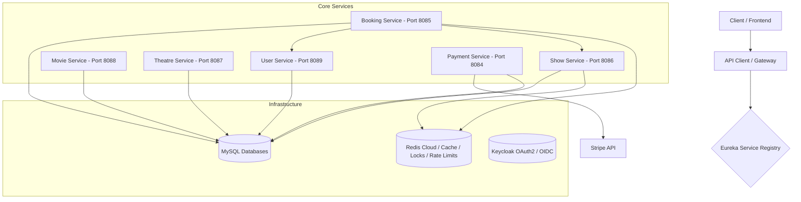

# SeatFlow

SeatFlow is a production-grade, resume-ready microservices-based ticketing application modeled after BookMyShow. It highlights advanced microservice patterns including distributed caching, service discovery, resilient service-to-service communication, distributed rate limiting, and atomic distributed locking.

---

## Architecture Overview



---

## Core Microservices & Port Map

* **`bookmyshow-eureka-server` (Port `8761`):** Netflix Eureka Service Discovery server.
* **`bookmyshow-user-service` (Port `8089`):** User profile management and authentication.
* **`bookmyshow-movie-service` (Port `8088`):** Cataloging movies, genres, actors, and ratings.
* **`bookmyshow-theatre-service` (Port `8087`):** Auditoriums, screens, seat layouts, and theatres.
* **`bookmyshow-show-service` (Port `8086`):** Show scheduling, seat mapping, and distributed locking.
* **`bookmyshow-booking-service` (Port `8085`):** Orchestrator for ticket creation, seat holds, and confirmations.
* **`bookmyshow-payment-service` (Port `8084`):** Integration with Stripe for secure transactional processing.

---

## Infrastructure Stack

* **Java 21** & **Spring Boot 3.5.6**
* **MySQL** (Relational databases per service)
* **Redis** (Hosted Cloud deployment)
  * Distributed seat hold locking via **Redisson Lua scripting**
  * Distributed rate limiting via **Redisson `RRateLimiter`**
  * Read-through caching (`showSeatsCache` and `staticSeatDetails`)
* **Resilience4j** (Circuit Breakers, Exponential Backoff Retries, and Time Limiters)
* **Spring Security & Keycloak** (OAuth2 JWT token validation)
* **Spring Cloud OpenFeign** (Resilient service-to-service communication)
* **Stripe Java SDK** (Payment processing & webhook consumption)

---

## Prerequisites

Ensure the following are installed and running locally:
1. **Java 21** & **Maven**
2. **MySQL Database Server**
3. **Keycloak Auth Server** running on `http://localhost:8080` with a realm named `bookmyshow` and a client id `bookmyshow-admin`.
4. **Redis Instance** (or configured Cloud URL)

### Required Databases
Create the following databases in MySQL:
* `bookmyshow_booking`, `bookmyshow_payment`, `bookmyshow_show`, `bookmyshow_theatre`, `bookmyshow_movie`, `bookmyshow_user`

---

## How to Start / Run the Project

You do **not** need to `cd` into every individual folder. You can run and manage all microservices directly from the **root project directory** using Maven's project list `-pl` flag. 

Open separate terminal tabs/windows in the root directory and start them in the recommended order:

```bash
# 1. Start Eureka Server (Required First)
mvn spring-boot:run -pl bookmyshow-eureka-server

# 2. Start Supporting Services
mvn spring-boot:run -pl bookmyshow-theatre-service
mvn spring-boot:run -pl bookmyshow-movie-service
mvn spring-boot:run -pl bookmyshow-user-service

# 3. Start Core Show Seat Locking & Cache Service
mvn spring-boot:run -pl bookmyshow-show-service

# 4. Start Booking & Orchestrating Service
mvn spring-boot:run -pl bookmyshow-booking-service

# 5. Start Payment Service
mvn spring-boot:run -pl bookmyshow-payment-service
```

---

## Key Resiliency & Scalability Patterns

### 1. Distributed Rate Limiting
To prevent automated scalper bots and API abuse, `bookmyshow-booking-service` implements distributed rate limiting using Redisson `RRateLimiter` stored in Redis:
* **Ticket Bookings / Cancellations:** Scoped per user account to a maximum of **3 requests per minute**.
* **Seat Layout Fetching:** Scoped to **15 requests per minute** to prevent scraping.
Rate limit exceptions are mapped to HTTP `429 Too Many Requests` with a `Retry-After` header.

### 2. Service-to-Service Resiliency (Feign Decorator Wrapper)
We use a **Resilient Delegate Wrapper Pattern** (`ResilientSeatClient`) to decouple resilience code from our transactional booking logic:
* **Exponential Backoff Retry:** Retries transient failures with multiplying delays (e.g. 500ms → 1000ms → 2000ms) up to 3 times for idempotent actions.
* **Circuit Breaker:** Fails fast after a 50% call failure threshold to protect thread pools from downstream service degradation.
* **TimeLimiter:** Enforces a strict 5-second timeout on downstream operations to prevent thread starvation.
* **Soft-Failure Exception Bridge:** Feign fallbacks return success wrappers with error codes (e.g., status 503). The delegate inspects these codes and throws exceptions to trigger the Resilience4j retry loop.

### 3. Safe retry via Idempotency
To prevent double-booking tickets during a retry attempt, `ShowSeatService.bookSeats(...)` validates current ownership:
* If a seat is already booked by the **same** ticket ID (duplicate retry request), it returns a successful response without modifying database state.
* If a seat is booked by a **different** ticket ID, it throws a conflict exception.
