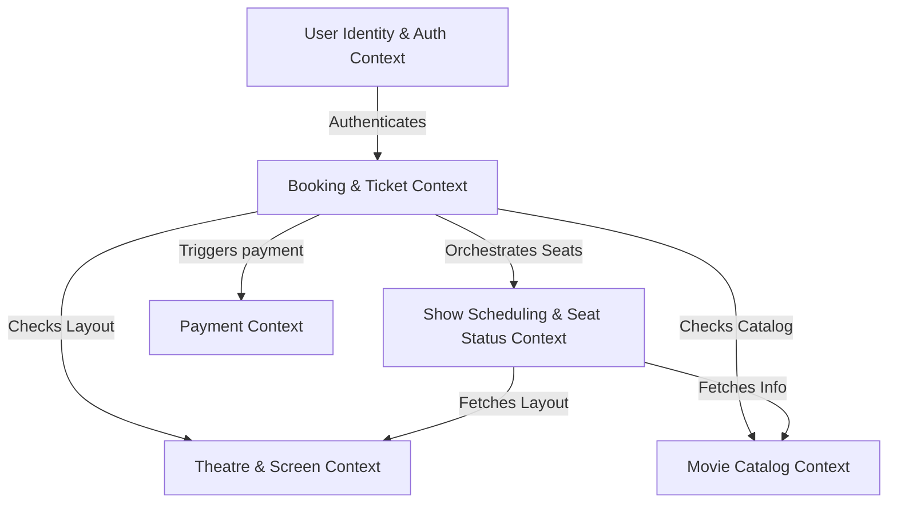

# Bounded Context Map & Glossary

This document maps out the Bounded Contexts of the **SeatFlow (BookMyShow Clone)** microservices ecosystem, defining the ubiquitous language and explaining the relationship between services.

---

## 1. Context Map Overview

The application is structured into the following bounded contexts:

---

## 2. Bounded Context Directory

### [User Identity & Auth Context](file:///c:/Users/devad/IdeaProjects/bookmyshow-microservices/docs/catalogs-and-users.md)
* **Owned by**: `bookmyshow-user-service`
* **Responsibilities**: Manages User accounts, Profile details, role provisioning, and synchronizes accounts with the central Keycloak IAM server.
* **Core Entities**: `User`, `Role`

### [Movie Catalog Context](file:///c:/Users/devad/IdeaProjects/bookmyshow-microservices/docs/catalogs-and-users.md)
* **Owned by**: `bookmyshow-movie-service`
* **Responsibilities**: Stores and serves metadata about movies, genres, language, duration, cast details, and ratings.
* **Core Entities**: `Movie`

### [Theatre & Screen Context](file:///c:/Users/devad/IdeaProjects/bookmyshow-microservices/docs/catalogs-and-users.md)
* **Owned by**: `bookmyshow-theatre-service`
* **Responsibilities**: Manages Physical theater structures, auditorium layout maps, screens, and static seat matrices (Row/Col positioning).
* **Core Entities**: `Theatre`, `Screen`, `Seat`

### [Show Scheduling & Seat Status Context](file:///c:/Users/devad/IdeaProjects/bookmyshow-microservices/docs/show-service.md)
* **Owned by**: `bookmyshow-show-service`
* **Responsibilities**: Schedules movie screenings on screens. Dynamically handles seat availability states (`AVAILABLE`, `HELD`, `BOOKED`). Orchestrates distributed atomic seat locking to prevent double bookings.
* **Core Entities**: `Shows`, `ShowSeat`

### [Booking & Ticket Context](file:///c:/Users/devad/IdeaProjects/bookmyshow-microservices/docs/booking-service.md)
* **Owned by**: `bookmyshow-booking-service`
* **Responsibilities**: Main business orchestrator. Validates user access, checks limits, holds seats, creates and manages ticket models, and changes booking states from `PENDING` to `CONFIRMED` or `EXPIRED`.
* **Core Entities**: `Ticket`

### [Payment Context](file:///c:/Users/devad/IdeaProjects/bookmyshow-microservices/docs/payment-service.md)
* **Owned by**: `bookmyshow-payment-service`
* **Responsibilities**: Interacts with the Stripe API gateway. Processes payment sessions, handles Stripe callback webhooks, and updates payment state.
* **Core Entities**: `Payment`

---

## 3. Ubiquitous Glossary

| Term | Context | Definition |
|---|---|---|
| **User** | User / Identity | A registered client or system administrator seeking to interact with the platform. |
| **Role** | User / Identity | Permissions template defining what actions a User is authorized to perform (e.g., `ROLE_USER`, `ROLE_ADMIN`). |
| **Movie** | Movie Catalog | A film listed in the catalog with static metadata (title, runtime, language). |
| **Theatre** | Theatre & Screen | A physical cinema hall branch that contains one or more screening auditoriums. |
| **Screen** | Theatre & Screen | An individual auditorium inside a Theatre with a designated screen size and seat arrangement. |
| **Seat** | Theatre & Screen | A static, physical seating spot inside a screen layout, mapped by row and column numbers. |
| **Show** | Show & Scheduling | A specific time-slot instance where a particular Movie is screened on a designated Screen. |
| **ShowSeat** | Show & Scheduling | The dynamic, runtime instance of a static `Seat` for a specific `Show`. Owns the availability status. |
| **Seat Status** | Show & Scheduling | The lifecycle state of a `ShowSeat`: `AVAILABLE` (can hold), `HELD` (temporarily reserved), or `BOOKED` (finalized/paid). |
| **Ticket** | Booking | A reservation record containing booking status (`PENDING`, `CONFIRMED`, `CANCELLED`), show details, booked seats, and user ID. |
| **Seat Hold** | Show & Scheduling | A short-lived, distributed lock that prevents other transactions from reserving the same seats. Defaults to 5 minutes. |
| **Payment Session** | Payment | An active payment request submitted to Stripe containing checkout amounts, currency, and redirect URLs. |
