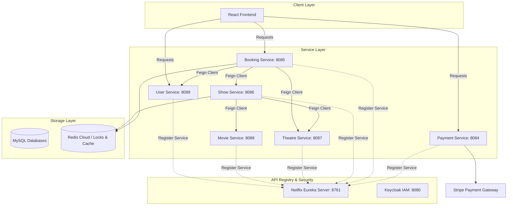

# Architecture Overview & Global Patterns

This document details the high-level system architecture, service discovery, security framework, and parent build configuration of the **SeatFlow (BookMyShow Clone)** microservices ecosystem.

---

## 1. High-Level System Architecture

SeatFlow is built as a microservices-based application using **Spring Boot 3.5.6** and **Java 21**, with MySQL databases mapped per service, and Redis acting as a shared distributed utility.



---

## 2. Parent Aggregator POM & Version Alignment

To prevent dependency drift across all seven microservices, a unified maven parent aggregator POM is configured at the root.

### Key Managed Stack:
* **Spring Boot**: `3.5.6`
* **Java**: `21`
* **Spring Cloud**: `2025.0.1` (Centralized open-feign and eureka client versions)
* **Spring Modulith**: `1.4.6`
* **Stripe Java SDK**: `31.3.0`
* **Keycloak SDK**: `25.0.3` (Admin client version: `26.0.7`)

All common dependencies (such as **Lombok**, **Spring Starter Test**, and **Spring Starter AOP**) are declared globally in the parent POM so they are automatically inherited, guaranteeing consistent testing and compilation settings.

---

## 3. Service Discovery via Netflix Eureka

All microservices register with the `bookmyshow-eureka-server` (running on port `8761`). Rather than hardcoding downstream service URLs, services resolve instances dynamically by their registered application names.

* **Client Invocation Pattern**: Standard declarative OpenFeign clients are annotated with `@FeignClient(name = "service-name")`.
* **Eureka Registry configuration**: Services are configured as Eureka Clients via:
  ```properties
  spring.application.name=bookmyshow-theatre-service
  eureka.client.service-url.defaultZone=http://localhost:8761/eureka/
  ```

---

## 4. Authentication & Security Architecture

Security is centralized using **Keycloak** (OpenID Connect / OAuth2 identity provider) running on port `8080` (realm `bookmyshow`, client id `bookmyshow-admin`).

### Security Strategy:
1. **OAuth 2.0 Authorization Server**: Keycloak handles user logins, token signatures, credentials management, and roles mapping.
2. **Resource Server Configuration**: Downstream services act as stateless Resource Servers. They validate JWT signatures locally using JSON Web Key Sets (JWKS) published by Keycloak.
   * Key security filter chain configuration:
     ```java
     http.oauth2ResourceServer(oauth2 -> oauth2.jwt(Customizer.withDefaults()));
     ```
3. **User Syncing**: The `bookmyshow-user-service` acts as a gateway mediator, exposing a `/createUser` endpoint that registers a user in both the local MySQL database and in Keycloak via the Keycloak Admin Java Client.
4. **Inter-Service Propagation**: (In-Progress) JWT credentials from incoming gateway requests are propagated to downstream microservices using Feign request interceptors.

---

## 5. Reputable Reference Sources

For in-depth explanations and official references on these architecture patterns:
* **Spring Cloud Eureka & Service Discovery**: [Baeldung Spring Cloud Netflix Eureka Tutorial](https://www.baeldung.com/spring-cloud-netflix-eureka)
* **Spring Cloud OpenFeign Reference**: [Spring Cloud OpenFeign Official Docs](https://docs.spring.io/spring-cloud-openfeign/docs/current/reference/html/)
* **Securing Spring Boot with Keycloak**: [Baeldung Spring Boot Keycloak Security Guide](https://www.baeldung.com/spring-boot-keycloak)
* **OAuth 2.0 Resource Server Setup**: [Spring Security Resource Server Documentation](https://docs.spring.io/spring-security/reference/servlet/oauth2/resource-server/jwt.html)
* **Maven Parent Aggregation**: [Baeldung Maven Multi-Module Project Guide](https://www.baeldung.com/maven-multi-module)
