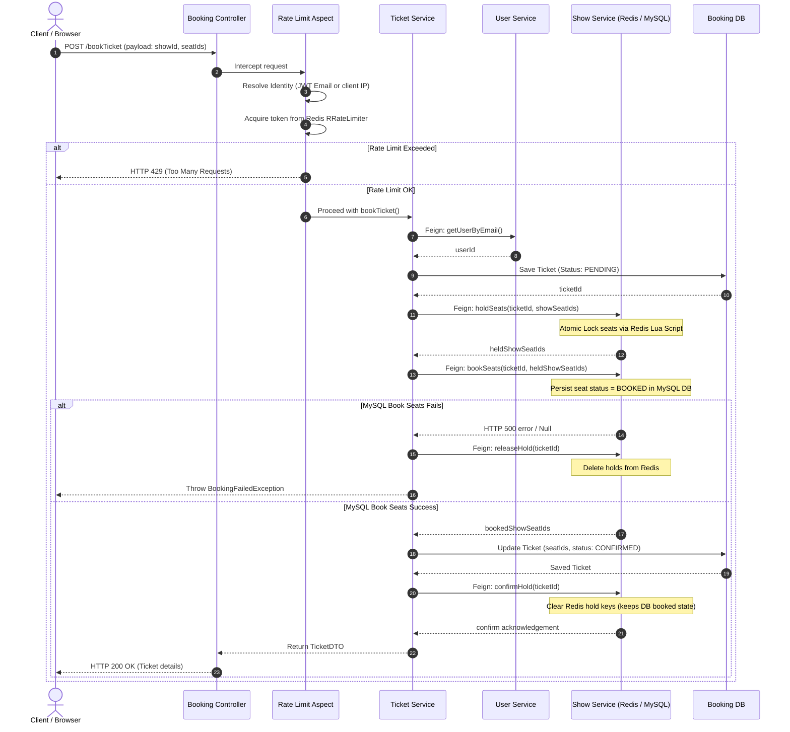

# Booking Service & Orchestration Flow

This document details the architecture, core classes, rate limiting, service-to-service resiliency patterns, and the transactional orchestration flow implemented in **`bookmyshow-booking-service`**.

---

## 1. Role in System

The `bookmyshow-booking-service` (Port `8085`) is the central orchestrator of the SeatFlow ticketing system. It exposes endpoints to book and cancel tickets, coordinates downstream queries to movie, theater, user, and show services, applies rate limiting, and manages ticket state transitions in its dedicated relational database.

---

## 2. Core Class deep-Dive

### [TicketController](file:///c:/Users/devad/IdeaProjects/bookmyshow-microservices/bookmyshow-booking-service/src/main/java/org/example/bookmyshowbookingservice/booking/api/TicketController.java)
* **Use**: REST controller exposing ticket management endpoints: `/bookTicket` (POST), `/cancelTicket/{ticketId}` (DELETE), and `/getSeats` (GET).
* **Optimized**: Exposes clean `@RateLimit` annotations to safeguard endpoints from excessive traffic.
* **Redundant**: Fully minimal.
* **Improvements**: Add batch seat lookup endpoints to lower HTTP handshake overhead.

### [TicketService](file:///c:/Users/devad/IdeaProjects/bookmyshow-microservices/bookmyshow-booking-service/src/main/java/org/example/bookmyshowbookingservice/booking/service/TicketService.java)
* **Use**: Contains business logic for orchestrating seat-mapping, validating shows, creating the database ticket record, initiating temporary Redis seat holds, confirming holds, and releasing resources on failure.
* **Optimized**: Uses `ModelMapper` for clean DTO mapping and handles optimistic locking exceptions (`OptimisticLockingFailureException`) during cancellation.
* **Redundant / Gap**: Currently directly injects the raw `SeatClient` Feign interface instead of the `ResilientSeatClient` decorator. This bypasses the Resilience4j circuit breakers and retries.
* **Improvements**: Change injection from `SeatClient` to `ResilientSeatClient` to enable retry loop coverage.

### [ResilientSeatClient](file:///c:/Users/devad/IdeaProjects/bookmyshow-microservices/bookmyshow-booking-service/src/main/java/org/example/bookmyshowbookingservice/booking/client/ResilientSeatClient.java)
* **Use**: Decorator wrapper applying Resilience4j `@Retry` (exponential backoff) and `@CircuitBreaker` to all show-service interactions.
* **Optimized**: Solves the "Soft Failure Swallow" issue. Standard Feign Fallbacks (`SeatClientFallback`) return a HTTP `503` wrapper instead of throwing exceptions. This class inspects those codes via `validateResponse()` and programmatically throws a `DownstreamServiceException`, triggering the Resilience4j retry loop.
* **Redundant**: Not currently referenced in `TicketService`.
* **Improvements**: Actively inject this in `TicketService` as a wrapper delegate.

### [RateLimitAspect](file:///c:/Users/devad/IdeaProjects/bookmyshow-microservices/bookmyshow-booking-service/src/main/java/org/example/bookmyshowbookingservice/common/aspect/RateLimitAspect.java)
* **Use**: AOP interceptor implementing Token Bucket rate limiting via Redisson `RRateLimiter`. Resolves user identifiers from Keycloak JWT claims or client IP addresses.

---

## 3. Auxiliary & Shared Classes

| Class | Package | Use |
|---|---|---|
| `Ticket` | `.booking.model` | Hibernate JPA entity representing a booking (stores ticket ID, show ID, user ID, and seat ID lists). |
| `FeignClientConfig` | `.config` | Feign interceptor applying OAuth2 authorization headers to outgoing inter-service requests. |
| `ServiceTokenProvider` | `.config` | Retrieves and caches service-to-service credentials from Keycloak using OAuth2 client credentials grant. |
| `GlobalExceptionHandler` | `.common.exception` | Intercepts validation, rate-limiting, and downstream exceptions, mapping them to standard API responses. |
| `SeatClientFallback` | `.booking.client.impl` | Standard Feign fallback component returning soft-failure `503` status values. |

---

## 4. Ticket Booking Sequence Diagram

This diagram displays the complete runtime flow when a user requests to book seats:

---

## 5. Reputable Reference Sources

* **Spring Cloud Declarative Feign Clients**: [Spring Cloud OpenFeign Reference](https://docs.spring.io/spring-cloud-openfeign/docs/current/reference/html/)
* **Resilience4j Circuit Breakers & Retry**: [Resilience4j Official User Guide](https://resilience4j.readme.io/docs)
* **Spring AOP & Custom Annotations**: [Baeldung Spring AOP Tutorial](https://www.baeldung.com/spring-aop-vs-aspectj)
* **OAuth2 Bearer Token Propagation in Feign**: [Baeldung Feign Interceptors Guide](https://www.baeldung.com/spring-cloud-feign-oauth-token)
