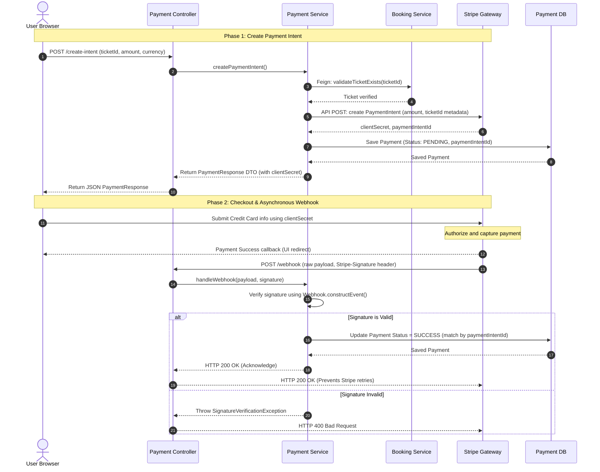

# Payment Service & Stripe Integration

This document details the configuration, class structure, security validation, and webhook handling implemented in **`bookmyshow-payment-service`** to process transactional payments.

---

## 1. Role in System

The `bookmyshow-payment-service` (Port `8084`) manages Stripe-based checkout workflows. It verifies ticket IDs, requests checkout sessions from the Stripe payment gateway, and consumes asynchronous Stripe event notifications (webhooks) to log final payment status.

---

## 2. Core Class deep-Dive

### [PaymentController](file:///c:/Users/devad/IdeaProjects/bookmyshow-microservices/bookmyshow-payment-service/src/main/java/org/example/bookmyshowpaymentservice/payment/api/PaymentController.java)
* **Use**: Exposes REST endpoints to create payment intents (`/api/payments/create-intent`) and consumes raw HTTP webhook events from Stripe (`/api/payments/webhook`).
* **Optimized**: Securely captures the raw payload string and HTTP header `Stripe-Signature` to protect webhook endpoints.
* **Redundant**: Fully minimal.
* **Improvements**: Restrict access to `/api/payments/webhook` via network-level IP whitelist checks to accept traffic only from Stripe servers.

### [PaymentService](file:///c:/Users/devad/IdeaProjects/bookmyshow-microservices/bookmyshow-payment-service/src/main/java/org/example/bookmyshowpaymentservice/payment/service/PaymentService.java)
* **Use**: Creates payment intents by calling `PaymentIntent.create(params)`. Handles decimal conversion to minor units (e.g. cents).
* **Optimized (Sandbox Mocking)**: Integrates local sandbox developers without Stripe keys:
  ```java
  if ("sk_test_mock_dev_key".equals(stripeProperties.getSecretKey())) {
      stripePaymentIntentId = "pi_mock_" + UUID.randomUUID();
  }
  ```
  If mock properties are set, the service bypasses Stripe network calls and generates mock client secrets to prevent startup crashes.
* **Optimized (Signature Verification)**: Validates that webhook request payloads are genuinely signed by Stripe using a shared secret key via:
  ```java
  Webhook.constructEvent(payload, signatureHeader, webhookSecret);
  ```
* **Redundant / Architecture Gap**: Once a payment succeeds or fails, the service updates its local database `Payment` record status, but it does *not* notify the `bookmyshow-booking-service` to finalize or release the ticket.
* **Improvements**: Integrate an event bus (e.g., Kafka) or initiate a Feign client update callback to change ticket status once a webhook is processed.

---

## 3. Auxiliary & Shared Classes

| Class | Package | Use |
|---|---|---|
| `Payment` | `.payment.model` | Entity representing a transaction (saves payment ID, ticket ID, currency, amount, and stripe intent metadata). |
| `PaymentStatus` | `.payment.model` | Enum representing the lifecycle of a payment: `PENDING`, `SUCCESS`, `FAILED`, `CANCELED`. |
| `StripeProperties` | `.payment.config` | Binds configuration properties from `application.properties` (API keys, webhook secrets, callback URLs). |
| `StripeConfig` | `.payment.config` | Spring configuration bean setting the global static `Stripe.apiKey` variable at runtime. |

---

## 4. Stripe Checkout & Webhook Flow (Sequence Diagram)

This diagram details the split-phase checkout intent creation and async webhook callback flow:



---

## 5. Reputable Reference Sources

* **Stripe Java SDK Integration**: [Stripe API Reference - PaymentIntents](https://stripe.com/docs/api/payment_intents)
* **Verifying Stripe Webhook Signatures**: [Stripe Webhooks Documentation](https://stripe.com/docs/webhooks/signatures)
* **Baeldung Spring Boot Stripe Integration Guide**: [Baeldung Stripe Tutorial](https://www.baeldung.com/spring-boot-stripe)
