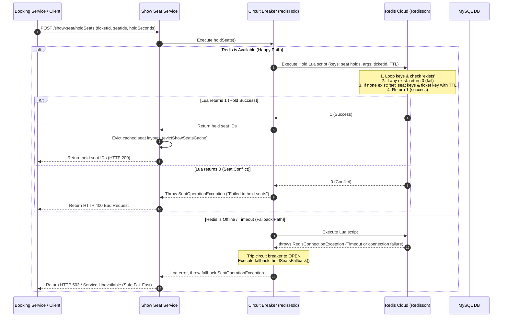

# Show Service & Seat Locking Flow

This document details the configuration, class structure, distributed caching, atomic locking mechanism, and the sequence of seat reservation operations implemented in **`bookmyshow-show-service`**.

---

## 1. Role in System

The `bookmyshow-show-service` (Port `8086`) manages showtimes, maps auditoriums, tracks live seat availability status (`AVAILABLE`, `LOCKED`/`HELD`, `BOOKED`), and coordinates high-concurrency seat locking. It acts as the primary data guardian preventing duplicate seat bookings.

---

## 2. Core Class deep-Dive

### [ShowSeatService](file:///c:/Users/devad/IdeaProjects/bookmyshow-microservices/bookmyshow-show-service/src/main/java/org/example/bookmyshowshowservice/show/service/ShowSeatService.java)
* **Use**: Exposes methods to search seat maps, reserve holds, confirm holds, cancel bookings, and unlock seats. Handles circuit-breaker wrapping for all Redisson interactions.
* **Optimized (Self-Injection Pattern)**: To support caching of static seat layouts, the class self-injects a proxy bean:
  ```java
  @Autowired @Lazy private ShowSeatService self;
  ```
  Calling `self.getStaticSeatDetails()` ensures Spring interceptors intercept the invocation and return the cached value. A standard direct `this.getStaticSeatDetails()` call would bypass the cache aspect.
* **Optimized (Circuit Breaker Fallbacks)**: Methods like `holdSeats()`, `releaseHold()`, and `confirmHold()` are annotated with Resilience4j `@CircuitBreaker`. If Redis goes offline, they catch the error and execute database-backed fallbacks.

### [SeatHoldService](file:///c:/Users/devad/IdeaProjects/bookmyshow-microservices/bookmyshow-show-service/src/main/java/org/example/bookmyshowshowservice/show/service/SeatHoldService.java)
* **Use**: Interacts directly with the `RedissonClient` to run high-speed atomic Lua scripts in the Redis instance.
* **Optimized**: Executes all-or-nothing seat locks atomically. If any seat is already locked, it rolls back and returns immediately in a single Redis thread execution cycle.

---

## 3. Auxiliary & Shared Classes

| Class | Package | Use |
|---|---|---|
| `Shows` | `.show.model` | Entity representing a scheduled show (contains show time, movie reference, screen reference). |
| `ShowSeat` | `.show.model` | Entity mapping a specific seat to a show instance (holds database properties `isBooked`, `ticketId`, and `lockedUntil` fallback timestamp). |
| `RedissonConfig` | `.config` | Configures the single-server connection pool settings for Redis Cloud and provisions startup dynamic proxies. |
| `ShowSeatRepository` | `.show.repository` | Handles JPA database updates for seat mappings and booked status. |

---

## 4. Atomic seat Locking Flow (Sequence Diagram)

This diagram details the transactional locking sequence when checking and holding seats:



---

## 5. Reputable Reference Sources

* **Redis Lua Script Transactions**: [Redis Transactions and Scripting Guide](https://redis.io/docs/manual/programmability/)
* **Resilience4j Circuit Breakers**: [Resilience4j Official User Guide](https://resilience4j.readme.io/docs/circuitbreaker)
* **Spring Bean Self-Injection Pattern**: [Baeldung Spring Bean Self-Injection](https://www.baeldung.com/spring-self-injection)
* **Redisson Connection Pool Tuning**: [Redisson Single Server Settings](https://github.com/redisson/redisson/wiki/2.-Configuration#26-single-redis-server-settings)
